<div align="center">


# FraudLens

### Stop the scam before the money moves: real-time fraud decisions for mobile money, explained in Bangla and reviewed by people


[Quick start](#-run-it-in-one-command) · [How it works](#-how-it-works) · [Results](#-results) · [Console tour](#%EF%B8%8F-console-tour) · [Three-minute demo](#-three-minute-demo) · [Limits](#%EF%B8%8F-what-this-is-not)

</div>

---

> **Why is this hard?** In an authorised-push-payment scam, *the victim presses "send" themselves*. Their phone, PIN and location are all genuine, so checks on the sender see a normal payment. A caller pretending to be wallet staff, a "lottery fee", an "investment" with daily returns: the money goes to a mule wallet and is cashed out at an agent within minutes.
>
> **FraudLens answers one question, in about 5 milliseconds:** *is this payment going to a scammer, and if so, what is the gentlest thing that will stop it?*

<table>
<tr>
<td align="center"><h2>1.45M</h2>simulated transactions<br/>over 120 days</td>
<td align="center"><h2>87.8%</h2>of scams caught<br/>at the warning tier</td>
<td align="center"><h2>0.59%</h2>of honest payments<br/>interrupted</td>
<td align="center"><h2>4.9 ms</h2>p95 to score, decide<br/>and explain</td>
<td align="center"><h2>0</h2>differences between<br/>served and evaluated</td>
</tr>
</table>

<div align="center">
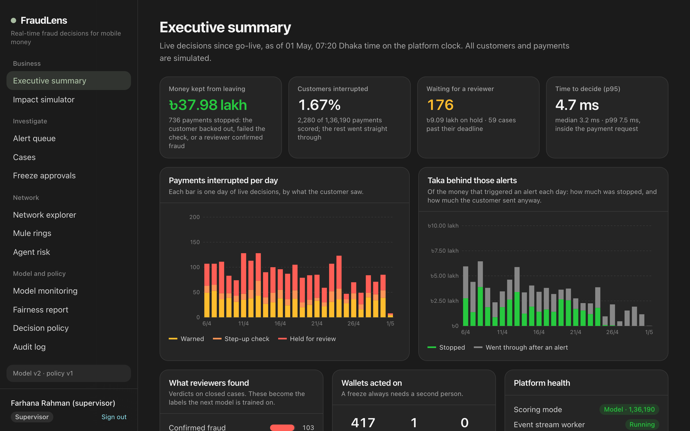
</div>

> All data is **synthetic**. One scam type was hidden from training on purpose, so the numbers include a scam the models had never seen. See [what this is not](#%EF%B8%8F-what-this-is-not).

---

## 🎯 The problem and how we answer it

| The problem | What FraudLens does | Where to see it |
|---|---|---|
| The **sender looks normal**, because the victim is the one paying | Scores the **receiving wallet and its network** as well as the sender | `Alert queue` · `Payment` |
| A blocked payment is too late and too blunt | Four tiers: **allow → warn → step-up → hold**, the first two decided by the customer | `Customer phone demo` |
| Customers do not read English warnings | Fixed, reviewed warning texts in **Bangla and English** | `Decision policy` |
| "The model said so" is not an explanation | Exact **SHAP reasons** as plain sentences, a rule trace, and the closest past case | `Payment` |
| Money that got through is gone | A **second chance at cash-out**, plus agent peer comparison and ring detection | `Mule rings` · `Agent risk` |
| Automation should not freeze someone's money | A hold waits for **an analyst**; a freeze needs **two people** | `Cases` · `Freeze approvals` |
| Models go stale | Verdicts become labels, challengers run in **shadow mode**, drift and fairness are on a dashboard | `Model monitoring` · `Fairness report` |

**Hero workflow:** a customer types a number and an amount. Before the money moves, the phone shows a scam warning in Bangla. A riskier payment asks them to verify again and wait out a cooling-off period. The riskiest is paused, lands at the top of an analyst's queue with its reasons, and stays paused until a person decides.

---

## 🔁 How it works

### One payment, start to finish

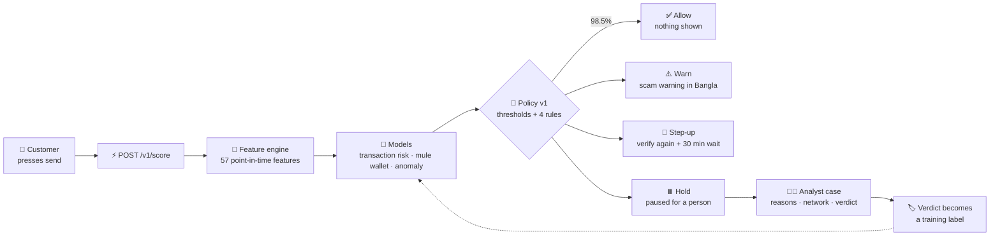

### What the customer and the analyst each see

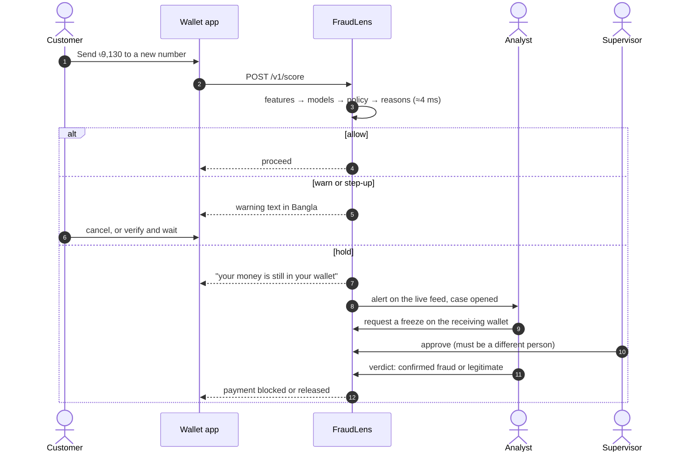

### The four tiers

| Tier | What happens | Who decides | False alerts per day, this tier and stricter |
|---|---|---|---:|
| ✅ **Allow** | Payment goes through, nothing is shown | nobody | n/a |
| ⚠️ **Warn** | A scam warning; the customer may continue | the customer | 31.0 |
| 🔐 **Step-up** | Verify again, then a 30-minute cooling-off | the customer | 8.5 |
| ⏸️ **Hold** | Paused, with a 30-minute review deadline | **a human analyst** | 2.8 |

That is out of about 5,400 scored payments a day.

The warning a customer reads before sending to a suspected mule:

> টাকা পাঠানোর আগে একটু থামুন। প্রতারকরা উপায় কর্মকর্তা, লটারি কর্তৃপক্ষ বা বিনিয়োগ এজেন্ট সেজে এ ধরনের ওয়ালেটে টাকা পাঠাতে বলে। আপনি কি এই ব্যক্তিকে চেনেন, এবং নিজের সিদ্ধান্তেই টাকা পাঠাচ্ছেন?
>
> *Pause before you send. Scammers pose as upay staff, lottery officials or investment agents and ask people to send money to wallets like this one. Do you know this person, and did you decide to pay them yourself?*

---

## 🖥️ Console tour

<table>
<tr>
<td width="50%">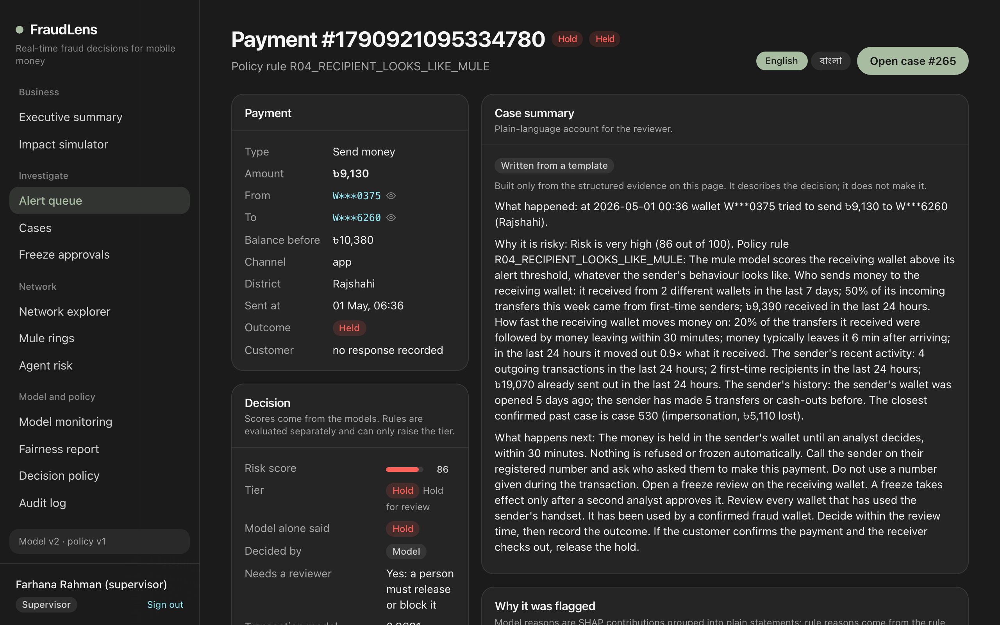<br/><b>Why it was flagged.</b> Ranked reasons with the facts behind them, the rule trace, and a case summary in English or বাংলা.</td>
<td width="50%">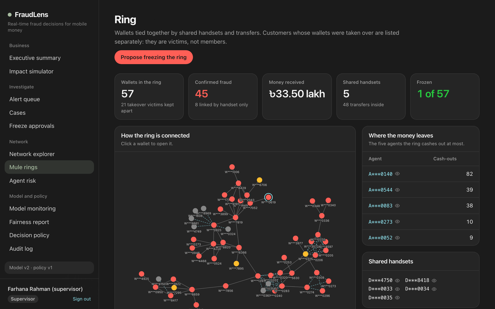<br/><b>Mule rings.</b> Wallets tied by shared handsets and transfers. Takeover victims are listed apart from members.</td>
</tr>
<tr>
<td>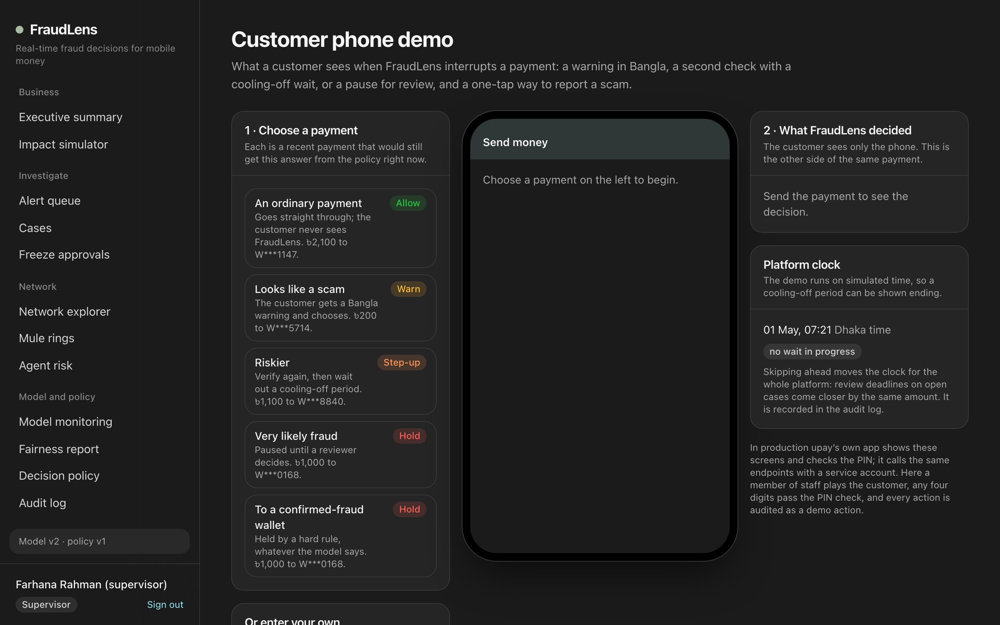<br/><b>Customer phone demo.</b> Plays the wallet app against the real scoring endpoint, side by side with what FraudLens decided.</td>
<td>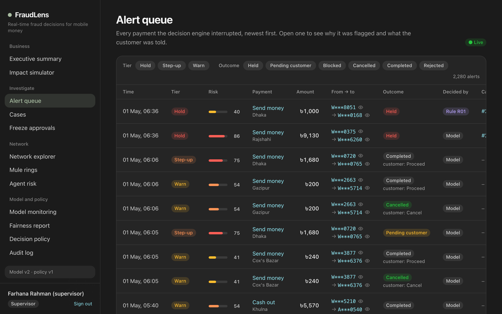<br/><b>Alert queue.</b> Every interrupted payment, newest first, arriving over a live feed. Wallet numbers stay masked until a reveal is audited.</td>
</tr>
<tr>
<td>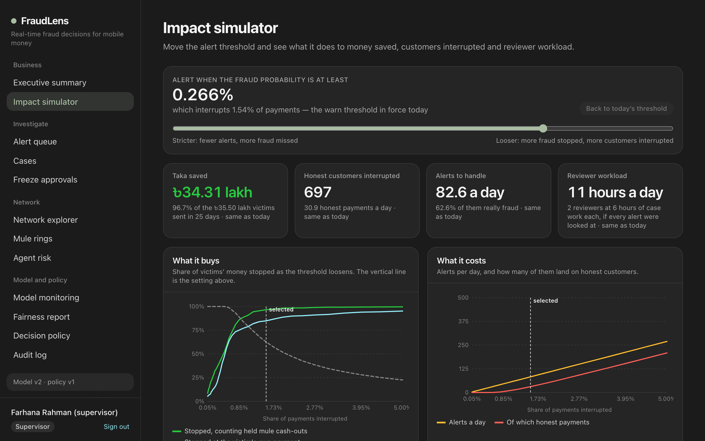<br/><b>Impact simulator.</b> Move the threshold and watch money saved, honest customers interrupted and reviewer hours move together.</td>
<td>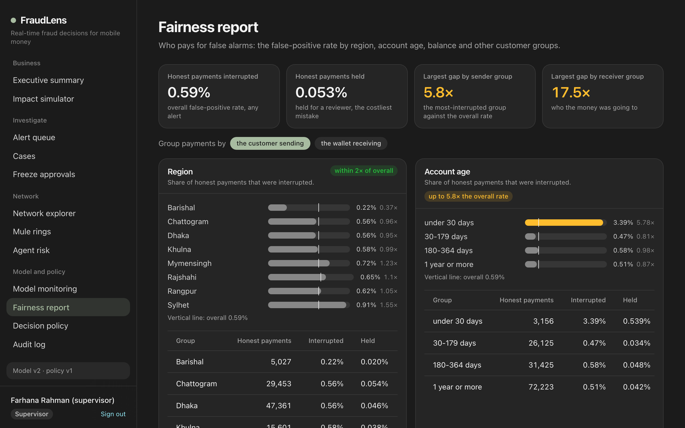<br/><b>Fairness report.</b> Who pays for false alarms, by region, account age, balance and channel.</td>
</tr>
</table>

| Page | What it does |
|---|---|
| **Executive summary** | Money stopped, customers interrupted, reviewer backlog and decision latency, from the live service |
| **Impact simulator** | The trade-off between fraud stopped and customers interrupted, at any threshold |
| **Alert queue → Payment** | Reasons, rule trace, similar past cases, the customer's message and recommended next steps |
| **Cases** | One case per wallet with a review deadline: assign, note, escalate, give a verdict |
| **Freeze approvals** | The second person of the two-person rule |
| **Network explorer · Mule rings · Agent risk** | Follow the money, see shared handsets, rank agents against their peers |
| **Model monitoring** | Performance by tier and scam type, drift, the model registry, shadow mode, the feedback loop |
| **Fairness report · Decision policy · Audit log** | False alarms by group, the exact rules and texts in force, and who did what |

---

## 📊 Results

Every number comes from the 25-day test period (134,545 scored payments, ৳35.5 lakh at risk), with thresholds fixed beforehand on validation data. Full tables are in the [model card](docs/MODEL_CARD.md).

### Each model against a rules-only system

A hand-written rule set, the kind many wallets run today, is right about one alert in eight. The served model is right about eight in ten at the same alert budget.

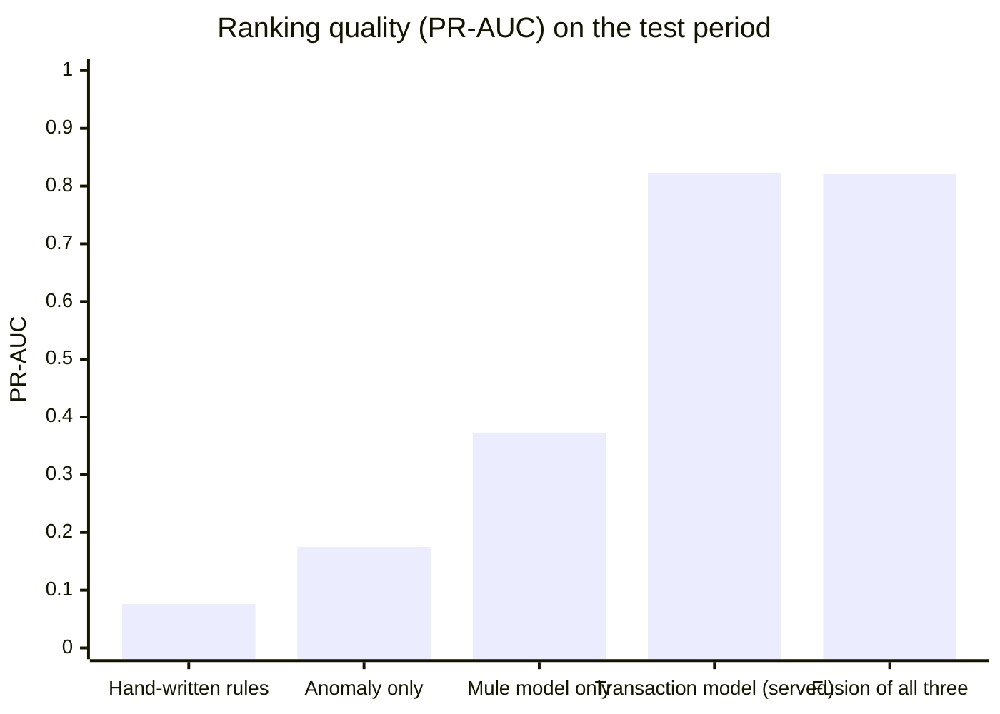

The fusion did not beat the single model, so the simpler model is served and the comparison is kept.

### A scam type the models never saw

`investment_scam` does not exist in the training period and is built to defeat the easy signals: aged wallets, private handsets, money sent back to the victim to build trust.

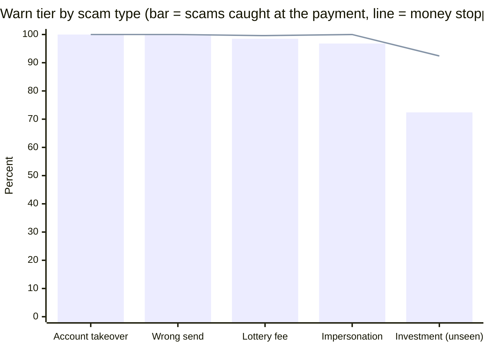

Most of the unseen scam is still caught at the warning level, mainly through **signals about the receiving wallet**, and most of the rest is recovered at cash-out. At the stricter tiers it falls to 55.3% (step-up) and 40.8% (hold). The near-perfect bars on known types are a property of scripted synthetic fraud and should not be expected on real traffic.

### How much money each tier stops

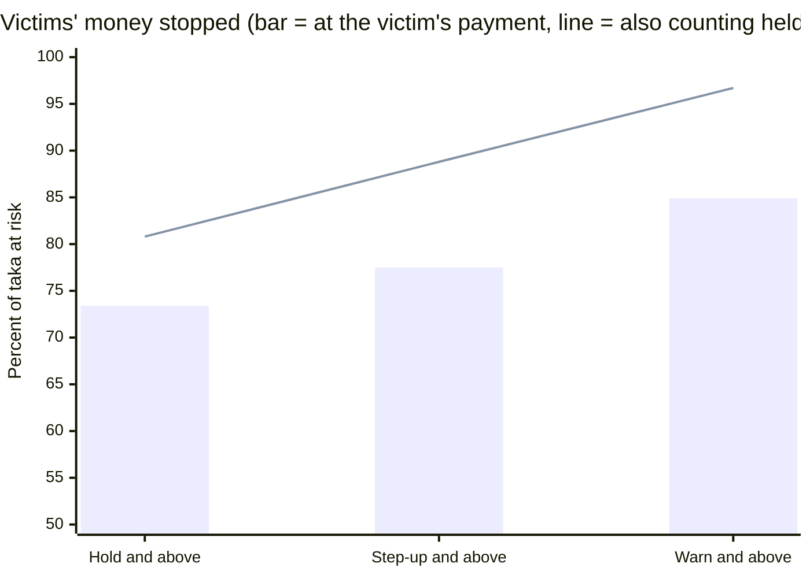

The line assumes the hold on the mule's cash-out succeeds, so it is an upper bound on recovery, not a promise.

### Where the interruptions land

98.5% of scored payments are never interrupted. Of the 2,076 that were:

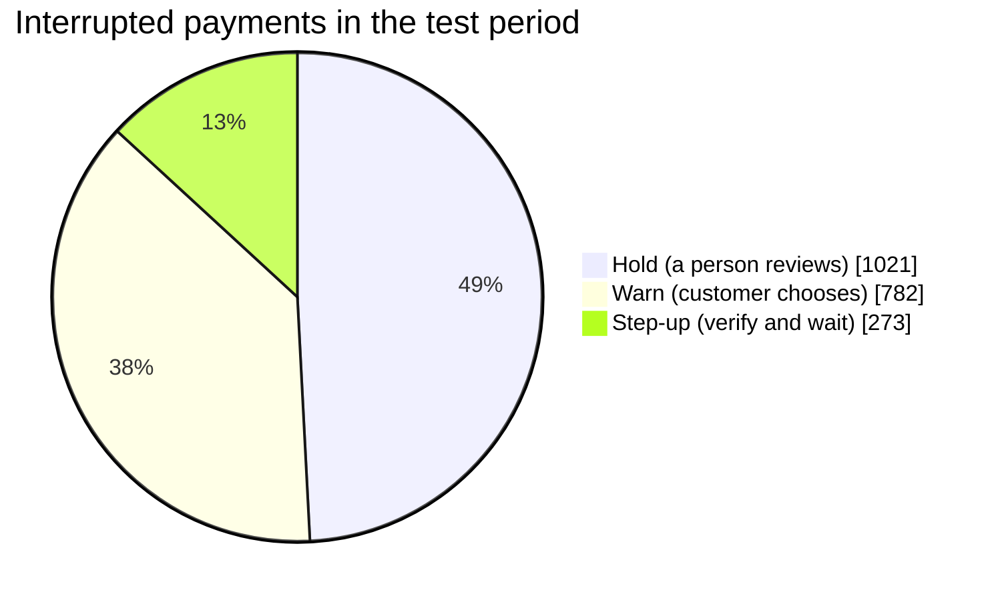

### Beyond single payments

| | Result |
|---|---|
| 🕵️ **Mule wallets** | 94 of 145 mules detected, **68 of them before any victim had paid**, a median 39.3 hours ahead of the victim's report |
| 🕸️ **Rings** | 33 rings covering 333 wallets; 94% of ring members are true fraud-cell wallets |
| 🏪 **Agents** | No labels used: 90.9% precision in a review list of 22, finding all commission-farming agents |
| 🔁 **Feedback loop** | Retraining on analyst verdicts raised PR-AUC from 0.759 to 0.904 on later data (reviewers were simulated and always right, so this is an upper bound) |
| 👥 **Shadow mode** | The challenger scored all 136,180 served decisions without deciding any; it agrees on the tier for 98.5% |

---

## 🛡️ Trust and evaluation

A fraud system that cannot be checked is not one a bank can run. These are the checks in the repository.

**The dashboards describe the service that is actually running.** The whole test period was replayed through the live API and event stream, and `make verify` compared every served decision with the offline evaluation:

| Check | Result |
|---|---:|
| Scored transactions compared | **136,180 of 136,180** |
| Tier differs | **0** |
| Feature rows that differ | **0** |
| Served in rules-only mode | 0 |
| Dead-lettered or failed events | 0 |

**It is fast enough to sit inside a payment request** (one process, on a laptop):

| Milliseconds | p50 | p95 | p99 |
|---|---:|---:|---:|
| Features + models + policy + reasons | 3.8 | **4.9** | 7.1 |
| Full round trip, including the database commit | 10.6 | 15.1 | 23.3 |

About 190 scored decisions a second through the stream, and ready 8–10 seconds after a restart with the feature state rebuilt exactly.

**Guardrails that are enforced in code, not left to configuration:**

| Guardrail | How it is enforced |
|---|---|
| The model never blocks money | A policy whose hold tier lacks human review **fails validation and will not load** |
| A freeze needs two people | Checked in the API and again by a database `CHECK` constraint |
| No training/serving skew | **One** feature engine class builds the training table and serves live |
| No look-ahead | Features use only state from before the transaction; a truncated-replay test checks it |
| The service answers without a model | Rules-only fallback, which never holds a payment on rule points alone |
| Nobody edits history | The audit log is append-only: a trigger refuses `UPDATE`, `DELETE` and `TRUNCATE` |
| Privacy by default | Wallet numbers are masked (`W***6128`); revealing one writes the viewer's name to the audit log |
| The language model only words things | Optional and off by default; its note is rejected if it contains a number or identifier that is not in the evidence |

**And the uncomfortable finding, stated plainly:** wallets under 30 days old are interrupted on honest payments **5.8×** as often as average when sending and **17.5×** when receiving. A young receiving wallet is also the strongest honest sign of a mule, so the gap cannot simply be removed. The fairness report measures it so that a deployment can watch it.

---

## 🏗️ Architecture

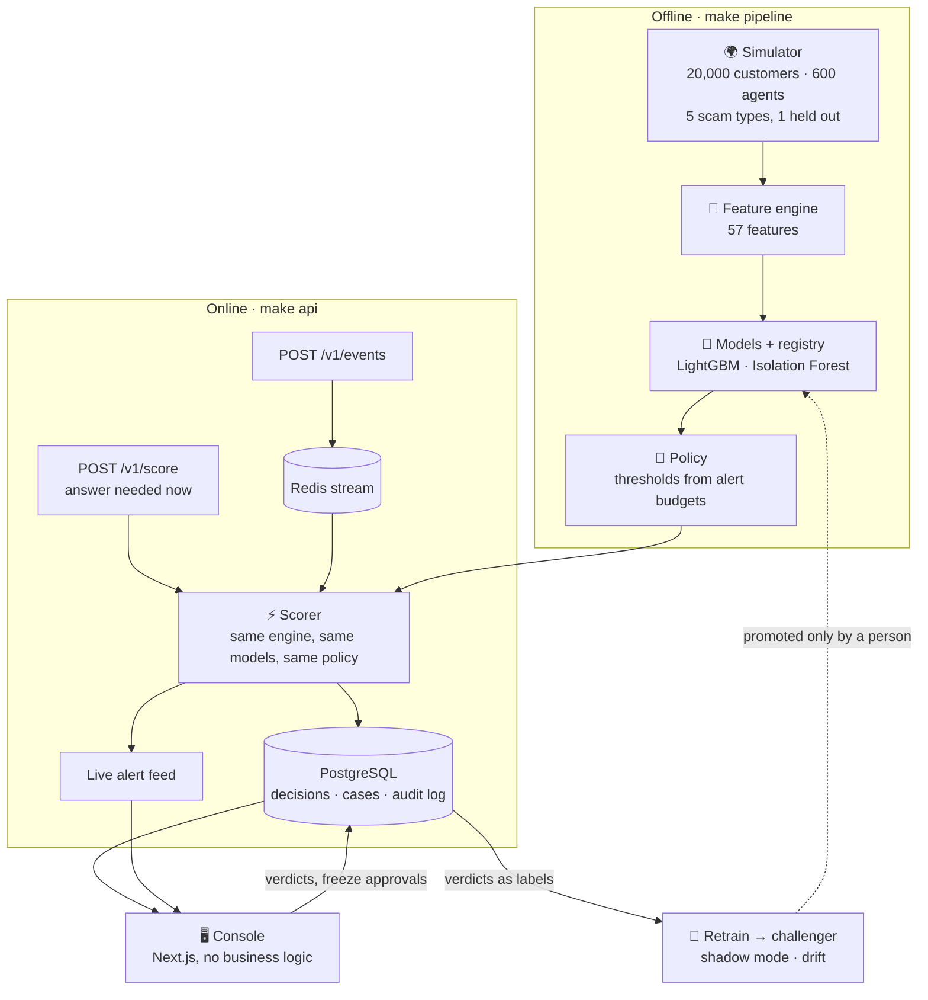

<details>
<summary><b>What each layer does</b></summary>

| Layer | What it does |
|---|---|
| Simulator | A 120-day world of wallets, agents and merchants with five fraud typologies, one of them held out of training, plus honest customers who look suspicious on purpose |
| Features | 57 point-in-time features from one engine used for both training and serving |
| Models | LightGBM transaction risk, mule-wallet score, Isolation Forest anomaly, agent peer comparison, ring detection |
| Decisions | allow / warn / step-up / hold from versioned rules and budgeted thresholds, with a rules-only fallback |
| Explanations | SHAP reasons in Bangla and English, rule trace, similar past cases, case summary |
| Platform | FastAPI scoring API, Redis Streams ingestion, Postgres, roles, append-only audit log |
| Console | Alert queue, case page, network explorer, ring freeze with second approval, agent risk, customer phone demo |
| MLOps | Verdicts become labels, retraining, model registry, shadow mode, drift, fairness report |

</details>

<details>
<summary><b>Tech stack and project layout</b></summary>

| Layer | Choice |
|---|---|
| Models | Python 3.12, LightGBM, scikit-learn, SHAP |
| API | FastAPI, SQLAlchemy, Alembic, PostgreSQL, Redis Streams and pub/sub, server-sent events |
| Console | Next.js 16, React 19, Tailwind CSS v4, d3-force |
| Ops | Make, Docker Compose, uv, pnpm, Playwright smoke test, GitHub Actions |

```
FraudLens/
├── backend/
│   ├── src/fraudlens/
│   │   ├── simulator/   # the synthetic world and its fraud cells
│   │   ├── features/    # one feature engine for training and serving
│   │   ├── models/      # training, evaluation, registry, agents, rings
│   │   ├── decision/    # policy file, rules, tiers, reasons, case notes
│   │   ├── platform/    # scorer, cases, freezes, stream worker, audit
│   │   ├── mlops/       # verdicts as labels, retraining, shadow, drift
│   │   └── api/         # HTTP routes, schemas, middleware
│   └── tests/           # 175 tests
├── frontend/            # the analyst console
├── docs/                # architecture, model card, policy, platform, demo script
├── docker-compose.yml
└── Makefile
```

</details>

---

## ⚡ Run it in one command

**Requirements:** Docker with Compose v2 (give Docker at least 4 GB of memory) and `make`.

```bash
git clone https://github.com/0xdevabir/FraudLens.git && cd FraudLens
make demo      # build, generate data, train, replay, serve
```

Then open **http://localhost:3100** and sign in as `analyst1`, `supervisor1` or `admin`. The password is generated on the first `make demo` and written to `backend/.env` as `FRAUDLENS_SEED_PASSWORD`.

The first start generates the dataset, trains the models, replays 25 days of traffic through the running service and retrains a challenger on the analysts' verdicts. That takes **about ten minutes** on a recent laptop, plus a few minutes to build the images, and progress is printed step by step. Later starts skip everything that already exists and are ready in under a minute.

| Account | Sees |
|---|---|
| `analyst1`, `analyst2` | alerts, cases, network, rings, agents, dashboards, the phone demo |
| `supervisor1`, `supervisor2` | the same, plus freeze approvals and the audit log |
| `admin` | dashboards and the audit log, no customer data |

```bash
make down          # stop, keep the data            (Ctrl-C in the first terminal also stops it)
make demo-reset    # stop and delete the database, dataset and models
```

The demo uses ports 3100 (console), 8010 (API), 5433 (Postgres) and 6380 (Redis), all bound to 127.0.0.1.

<details>
<summary><b>Develop on the host</b></summary>

Needs [uv](https://docs.astral.sh/uv/), Node 22 with pnpm (`corepack enable`), and Docker for Postgres and Redis.

```bash
cp backend/.env.example backend/.env   # then set FRAUDLENS_SEED_PASSWORD (12+ characters)
make setup         # backend and console dependencies
make up            # Postgres and Redis
make pipeline      # data, features, models, policy, dashboard tables
make platform      # migrate, demo accounts, load the historical period
make api           # API and stream worker on http://127.0.0.1:8010

# in a second terminal
make replay        # test days 95-118 through the event stream
make replay-live   # day 119 one request at a time; writes the latency report
make verify        # served decisions against the offline evaluation
make review        # close the older cases with the simulation's ground truth
make retrain       # train a challenger on those verdicts (promotes nothing)
make console       # console on http://localhost:3100
```

To run a challenger in shadow mode, set `FRAUDLENS_SHADOW_MODEL_VERSION` to its version (`make models` lists them) in `backend/.env` and restart the API. `make help` lists every target.

</details>

<details>
<summary><b>Check it</b></summary>

```bash
make test     # 175 backend tests; the platform tests need `make up`
make lint     # ruff, tsc, eslint
make smoke    # opens every console page as each role in a headless browser
```

`make smoke` needs the demo (or `make api` and `make console`) running and `make setup` done. CI (`.github/workflows/ci.yml`) runs the tests and the lint against real Postgres and Redis, builds the console and builds both images.

</details>

---

## 🎬 Three-minute demo

Keep two browser windows open: one as `analyst1`, one private window as `supervisor1`. The full ten-minute walk-through is in [docs/DEMO_SCRIPT.md](docs/DEMO_SCRIPT.md).

| Time | Beat |
|---|---|
| **0:00** | **Problem:** the victim sends the money themselves, so the sender looks normal. Open the **Executive summary**: 25 days of traffic replayed through the live API, one scam type never shown to the models. |
| **0:20** | **Customer phone demo:** an ordinary payment goes straight through. "Looks like a scam" shows the Bangla warning before the money moves. "Riskier" asks for a second check and a wait; skip the clock ahead to end it. |
| **1:00** | **Hold:** "Very likely fraud" is paused, not blocked. It appears at the top of the **Alert queue** over the live feed. |
| **1:20** | **Payment page:** the ranked reasons with the facts behind them, the rule trace, the closest past case. Switch the summary to বাংলা. Click a masked wallet number to reveal it. |
| **1:50** | **Two-person freeze:** request a freeze as the analyst, approve it as the supervisor in the other window. Then give the verdict **confirmed fraud**. |
| **2:20** | **Mule rings:** open a ring and see the wallets tied by shared handsets. |
| **2:35** | **Trust:** the **Fairness report** shows young wallets pay more for false alarms; the **Audit log** shows the reveal from 1:20 and cannot be edited. |
| **2:50** | **Close:** the model ranks and explains, the customer gets the first say, and a person makes every irreversible decision. |

---

## 📚 Documents

| | |
|---|---|
| [ARCHITECTURE.md](docs/ARCHITECTURE.md) | How the parts fit and why they are split that way |
| [DATA_ASSUMPTIONS.md](docs/DATA_ASSUMPTIONS.md) | What the synthetic world contains and what it leaves out |
| [MODEL_CARD.md](docs/MODEL_CARD.md) | Models, results, ablations, fairness, limits |
| [DECISION_POLICY.md](docs/DECISION_POLICY.md) | Tiers, rules, thresholds, explanations, the language model's role |
| [PLATFORM.md](docs/PLATFORM.md) | API, workflow, security, stream, measured latency |
| [DEMO_SCRIPT.md](docs/DEMO_SCRIPT.md) | The walk-through |

## ⚠️ What this is not

- **Everything runs on synthetic data,** so absolute numbers will not transfer to real traffic. Fraud is more common and more scripted here than in real life, and thresholds must be re-fitted on real data.
- **It is a prototype, not a deployment.** One scorer process holds the feature state, and there is no TLS, secrets manager or horizontal scaling.
- **The demo scaffolding is not the product.** The demo accounts, the phone demo endpoints and the review simulator exist only outside production mode.
- **No model output moves or blocks money on its own.** A hold waits for an analyst and a freeze needs two people.
- **The Bangla texts were written by the developers** and have not been reviewed by a professional translator.

The limits of each part are listed in its document under "Limits, stated plainly".

## 🌍 Impact

- **Customers:** a warning in their own language at the one moment it can still help, and far fewer honest payments interrupted than a rules-only system.
- **Fraud teams:** one case per mule wallet instead of one alert per victim, each with its reasons and its network already laid out.
- **The wallet operator:** a measurable trade-off between money saved, customers interrupted and reviewer hours, and an audit trail for every decision.

<div align="center">

Built by [0xdevabir](https://github.com/0xdevabir)

*FraudLens: the victim presses send, so look at where the money is going.*

</div>
